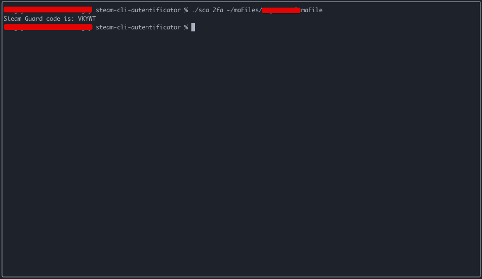

### Steam CLI Autentificator
This is a command-line tool written in Go that generates a Steam Guard authorization code (2FA) 
by providing a maFile (Mobile Authenticator) file. The maFile file contains a shared secret 
that is used to generate the Steam Guard code. The tool uses the HMAC-SHA1 algorithm to generate the code.

### Installation
1. Clone the repository to your local machine.
```
git clone https://github.com/SerjRamone/steam-cli-autentificator
```

2. Change directory to the cloned repository.
```
cd steam-cli-autentificator
```

3. Install the dependencies.
```
go mod download
```

4. Build the tool.
```
go build -o sca
```

### Usage
```
./sca 2fa /path/to/maFile
```
The path to the maFile is required.


### License
This tool is licensed under the [MIT License](LICENSE.md).
